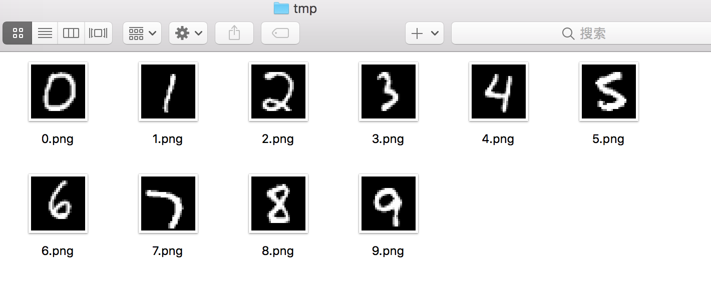

# keras 入门：卷积神经网络实现 MNIST 手写数字识别

手写数字识别问题作为机器学习领域中的一个经典问题，本文介绍如何使用 keras 构建卷积神经网络模型实现 MNIST 手写数字识别。文本代码只需更换训练集目录，修改图片输入尺寸和类别数量等少量参数，即可直接应用到其他图像分类的问题中。

## 一、数据准备

关于如何解析 MNIST 数据集，可以参看另一片文章：[python 读取 MNIST 数据集，并解析为图片文件](./mnist_parser.md)。解析出的数据集具有如下目录结构：
```text
mnist_data/
    |----train/
        |----0/
            |----0.png
        |----1/
            |----1.png
...
    |----test/
...
```

## 二、keras 搭建卷积神经网络

### 1. 卷积神经网络简介

卷积神经网络的概念最早出自 19 世纪 60 年代提出的感受野 ( Receptive Field [1])，到了 20 世纪 80 年代，日本科学家提出神经认知机 ( Neocognitron [2] ) 的概念，是卷积神经网络的实现原型。卷积神经网络可以利用空间结构关系减少需要学习的参数量，提高反向传播算法的训练效率。一般的 CNN 有多个卷积层构成，每个卷积层会进行如下操作：
- 图像通过多个不同的卷积核的滤波，并加偏置 ( bias )，提取出局部特征，每一个卷积核会映射出一个新的 2D 图像。
- 将前面卷积核的滤波输出结果进行非线性的激活函数处理。
- 对激活函数的结果再进行池化操作 （ 即降采样），目前一般是使用最大池化，保留最显著的特征，并提升模型的畸变容忍能力。
这几个步骤就构成最常见的卷积层，当然也可以在加上一个 LRN [3] ( Local Response Normalization，局部响应归一化层) 层。
    CNN 的要点是卷积核的权值共享 ( Weight Sharing )、局部连接模式 ( Local Connection )和池化层 ( Pooling ) 中的降采样 ( Down-Sampling )。局部连接和权值共享降低了参数量，使训练复杂度大大下降，减轻过拟合并降低计算量。同时权值共享还赋予了 CNN 对平移的容忍性，而池化层降采样则进一步降低了输出层参数，并赋予模型轻度形变的容忍性，提高模型的泛化能力。
    LeNet5 [4] 提出于1994 年，是最早的深层卷积神经网络之一。LeNet5 当时的特性有如下几点：
- 每个卷基层包含三个部分：卷积、池化和非线性激活函数
- 使用卷积提取空间特征
- 降采样的平均池化层
- 双曲正切或 S 型的激活函数
- MLP 作为最后的分类器
- 层与层之间的稀疏连接减少计算复杂度


### 2. 卷积神经网络搭建


使用 keras API 可以很容易搭建一个卷积神经网络，在此我们搭建的网络结构具有 重复三重的 3 * 3 卷积核加 2 * 2 最大池化层，最后加两个全连接层。

第一层卷积输入图像尺寸，设置64个卷积核，经过 2 * 2 最大池化层后，第二层卷积层需要 128 个卷积核，同理第三层卷积是 256 个卷积核。然后将矩阵平整为一维，接一层 256 输出的全链接层，最后一层输出为类别标签数的全连接层，并且该层使用 'softmax' 作为激活函数。

```text
def build_model(self):
    """构建网络模型"""
    setting = self.setting
    model = Sequential()
    model.add(Conv2D(64, (3, 3), input_shape=setting.input_shape))
    model.add(Activation('relu'))
    model.add(MaxPooling2D(pool_size=(2, 2)))
    model.add(Conv2D(128, (3, 3)))
    model.add(Activation('relu'))
    model.add(MaxPooling2D(pool_size=(2, 2)))
    model.add(Conv2D(256, (3, 3)))
    model.add(Activation('relu'))
    model.add(Flatten())
    model.add(Dropout(0.5))
    model.add(Dense(256))
    model.add(Activation('relu'))
    model.add(Dropout(0.5))
    model.add(Dense(setting.lebel_nums))
    model.add(Activation('softmax'))
    model.compile(loss='categorical_crossentropy',
                  optimizer='rmsprop',
                  metrics=['accuracy'])
    return model
```


使用 keras 的图像预处理类可以很容易加载图像数据并进行数据预处理，详情可以参考 keras 的官方文档：[ImageDataGenerator](https://keras-zh.readthedocs.io/preprocessing/image/)。将训练集划分 20% 作为验证集，将像素点缩放为 0～1.0 的尺度。
```text
def data_generator(self, setting: Setting):
    """图像数据生成器，对生成的字体图像划分训练集和验证集，同时进行数据增强，提高模型泛化能力。"""
    datagen = ImageDataGenerator(
        rescale=1.0 / 255,
        validation_split=0.2
    )
    train_generator = datagen.flow_from_directory(
        setting.train_dir,
        target_size=(setting.img_width, setting.img_height),
        batch_size=setting.batch_size,
        class_mode='categorical',
        subset='training'
    )
    validation_generator = datagen.flow_from_directory(
        setting.train_dir,
        target_size=(setting.img_width, setting.img_height),
        batch_size=setting.batch_size,
        class_mode='categorical',
        subset='validation'
    )
    return train_generator, validation_generator
```


在此，我将程序用到的一些参数的设置放置于一个设置类中：

```python
class Setting:
    """配置类"""
    def __init__(self):
        self.data_dir = 'mnist_data/'
        self.train_dir = self.data_dir + 'train'
        self.test_dir = self.data_dir + 'test'
        self.img_width = 28
        self.img_height = 28
        # 在不同系统中，通道数的位置可能不同，因此图像的输入维度略有不同
        if backend.image_data_format() == 'channels_first':
            self.input_shape = (3, self.img_width, self.img_height)
        else:
            self.input_shape = (self.img_width, self.img_height, 3)
        # 模型训练过程中，根据验证准确率的提升保存模型权重参数
        self.checkpoint_path = self.data_dir + 'model_weight/weights-improvement-{epoch:02d}-{val_acc:.5f}.hdf5'
        
        # 这两个参数可以设置加载现有模型继续重新训练
        self.restore_model = None
        self.is_restore = False
        # 模型应用预测可以将所需识别的图像放置于 tmp 文件夹中
        self.imp_dir = self.data_dir + 'tmp'

        # 模型训练的配置
        self.lebel_nums = 10
        self.epoches = 20   # 训练的总轮次
        self.save_epoches = 1   # 模型保存的检验轮次
        self.batch_size = 32
        self.initial_epoch = 0
```

全部代码见 [mnist_keras.py](./mnist_keras.py) 文件。 


### 3. 模型结果评估

训练模型只需以如下命令运行 mnist_keras.py 文件：
```text
python mnist_keras.py --mode train
```
在 GPU 中训练可以很快就能训练结束，第 8 轮中验证集正确率达到 0.98825 后便不再提升。

用测试集评估模型：
```
python mnist_keras.py --mode evaluate
```
得到 0.9895 的正确率。

在应用模型预测时，将图片放置于 tmp 文件夹中



运行模型预测
```
python mnist_keras.py --mode predict
```
运行后得到预测结果：
```text
mnist_dat/tmp/8.png
预测结果为：8
mnist_dat/tmp/9.png
预测结果为：9
mnist_dat/tmp/4.png
预测结果为：4
mnist_dat/tmp/5.png
预测结果为：5
mnist_dat/tmp/7.png
预测结果为：7
mnist_dat/tmp/6.png
预测结果为：6
mnist_dat/tmp/2.png
预测结果为：2
mnist_dat/tmp/3.png
预测结果为：3
mnist_dat/tmp/1.png
预测结果为：1
mnist_dat/tmp/0.png
预测结果为：0
```


---
## 参考文献
[1] Sherrington C S. Observations on the scratch-reflex in the spinal dog[J]. Journal of Physiology, 1906, 34(1-2):1.

[2] Fukushima K, Miyake S, Ito T. Neocognitron: a neural network model for a mechanism of visual pattern recognition[M]// Competition and Cooperation in Neural Nets. Springer Berlin Heidelberg, 1982:826-834.

[3] Krizhevsky A, Sutskever I, Hinton G E. ImageNet classification with deep convolutional neural networks[J]. Communications of the Acm, 2012, 60(2):2012.

[4] Lecun Y, Bottou L, Bengio Y, et al. Gradient-based learning applied to document recognition[J]. Proceedings of the IEEE, 1998, 86(11):2278-2324.