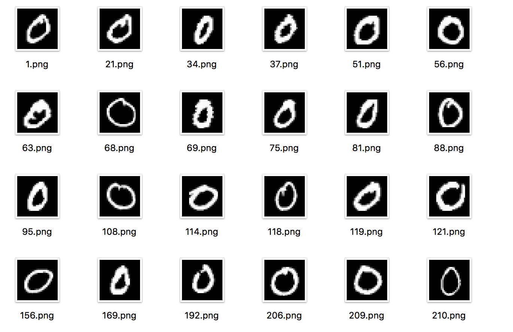

# python 读取 MNIST 数据集，并解析为图片文件


MNIST 是 Yann LeCun 收集创建的手写数字识别数据集，训练集有 60,000 张图片，测试集有 10,000 张图片。数据集链接为：[http://yann.lecun.com/exdb/mnist/](http://yann.lecun.com/exdb/mnist/)。数据集下载解压后有4个二进制 IDX 文件：
```text
train-images-idx3-ubyte: 训练集图片
train-labels-idx1-ubyte: 训练集标签 
t10k-images-idx3-ubyte:  测试集图片
t10k-labels-idx1-ubyte:  测试集标签
```

其中图像文件的数据格式为：
```text
TRAINING SET IMAGE FILE (train-images-idx3-ubyte):
[offset] [type]          [value]          [description] 
0000     32 bit integer  0x00000803(2051) magic number 
0004     32 bit integer  60000            number of images 
0008     32 bit integer  28               number of rows 
0012     32 bit integer  28               number of columns 
0016     unsigned byte   ??               pixel 
0017     unsigned byte   ??               pixel 
........ 
xxxx     unsigned byte   ??               pixel
```

文件头信息包含 4 个 unsinged int32 整型数据，分别是 魔数、图片数、图片宽度、图片长度。后面的数据是所有图像的像素的，每个byte一个像素点。图片的长宽都是 28，所以每张图片长度为 28*28。像素值取值范围是 0～255。

可以使用 python 的 [struct](https://docs.python.org/3/library/struct.html) 模块读取二进制数据，将图像像素转为 numpy 矩阵，因而可以使用下面的函数解析图像数据：
```python
import struct
import numpy as np

def decode_idx3_ubyte(idx3_ubyte_file):
    with open(idx3_ubyte_file, 'rb') as f:
        print('解析文件：', idx3_ubyte_file)
        fb_data = f.read()

    offset = 0
    fmt_header = '>iiii'    # 以大端法读取4个 unsinged int32
    magic_number, num_images, num_rows, num_cols = struct.unpack_from(fmt_header, fb_data, offset)
    print('魔数：{}，图片数：{}'.format(magic_number, num_images))
    offset += struct.calcsize(fmt_header)
    fmt_image = '>' + str(num_rows * num_cols) + 'B'

    images = np.empty((num_images, num_rows, num_cols))
    for i in range(num_images):
        im = struct.unpack_from(fmt_image, fb_data, offset)
        images[i] = np.array(im).reshape((num_rows, num_cols))
        offset += struct.calcsize(fmt_image)
    return images
```


标签数据文件的格式为：
```text
TRAINING SET LABEL FILE (train-labels-idx1-ubyte):
[offset] [type]          [value]          [description] 
0000     32 bit integer  0x00000801(2049) magic number (MSB first) 
0004     32 bit integer  60000            number of items 
0008     unsigned byte   ??               label 
0009     unsigned byte   ??               label 
........ 
xxxx     unsigned byte   ??               label
```

文件头是两个 unsinged int32 整型数据：魔数和标签数，后面每一个 byte 是一个标签值，标签值为 0～9。同样使用 struct 读取：
```python
import struct

def decode_idx1_ubyte(idx1_ubyte_file):
    with open(idx1_ubyte_file, 'rb') as f:
        print('解析文件：', idx1_ubyte_file)
        fb_data = f.read()

    offset = 0
    fmt_header = '>ii'  # 以大端法读取两个 unsinged int32
    magic_number, label_num = struct.unpack_from(fmt_header, fb_data, offset)
    print('魔数：{}，标签数：{}'.format(magic_number, label_num))
    offset += struct.calcsize(fmt_header)
    labels = []

    fmt_label = '>B'    # 每次读取一个 byte
    for i in range(label_num):
        labels.append(struct.unpack_from(fmt_label, fb_data, offset)[0])
        offset += struct.calcsize(fmt_label)
    return labels
```


解析出了图像像素和标签值后，就可以使用 cv2 模块将像素矩阵保存为图像文件，根据标签值保存在不同的目录下：
```python
import numpy as np
import os
import cv2

def check_folder(folder):
    """检查文件文件夹是否存在，不存在则创建"""
    if not os.path.exists(folder):
        os.mkdir(folder)
        print(folder)
    else:
        if not os.path.isdir(folder):
            os.mkdir(folder)


def export_img(exp_dir, img_ubyte, lable_ubyte):
    """
    生成数据集
    """
    check_folder(exp_dir)
    images = decode_idx3_ubyte(img_ubyte)
    labels = decode_idx1_ubyte(lable_ubyte)

    nums = len(labels)
    for i in range(nums):
        img_dir = os.path.join(exp_dir, str(labels[i]))
        check_folder(img_dir)
        img_file = os.path.join(img_dir, str(i)+'.png')
        imarr = images[i]
        cv2.imwrite(img_file, imarr)


def parser_mnist_data(data_dir):

    train_dir = os.path.join(data_dir, 'train')
    train_img_ubyte = os.path.join(data_dir, 'train-images-idx3-ubyte')
    train_label_ubyte = os.path.join(data_dir, 'train-labels-idx1-ubyte')
    export_img(train_dir, train_img_ubyte, train_label_ubyte)

    test_dir = os.path.join(data_dir, 'test')
    test_img_ubyte = os.path.join(data_dir, 't10k-images-idx3-ubyte')
    test_label_ubyte = os.path.join(data_dir, 't10k-labels-idx1-ubyte')
    export_img(test_dir, test_img_ubyte, test_label_ubyte)


if __name__ == '__main__':
    data_dir = 'mnist_data/'
    parser_mnist_data(data_dir)
```

最后得到具有如下目录结构的数据集：
```text
mnist_data/
    |----train/
        |----0/
            |----0.png
        |----1/
            |----1.png
...
    |----test/
...
```

解析出具有下面形式的图像数据：

