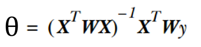
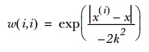
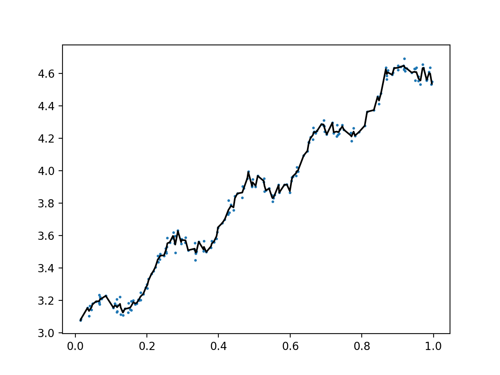
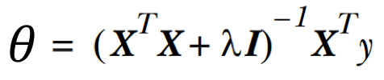
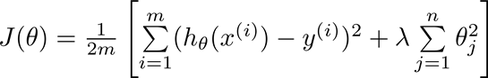
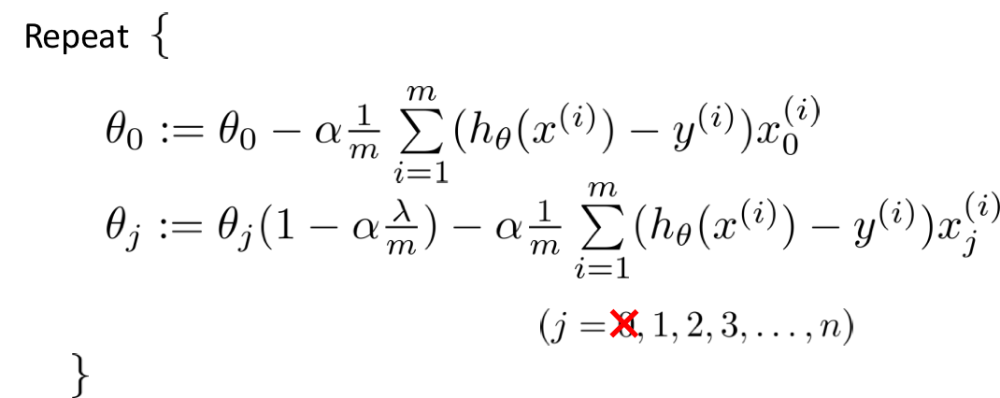
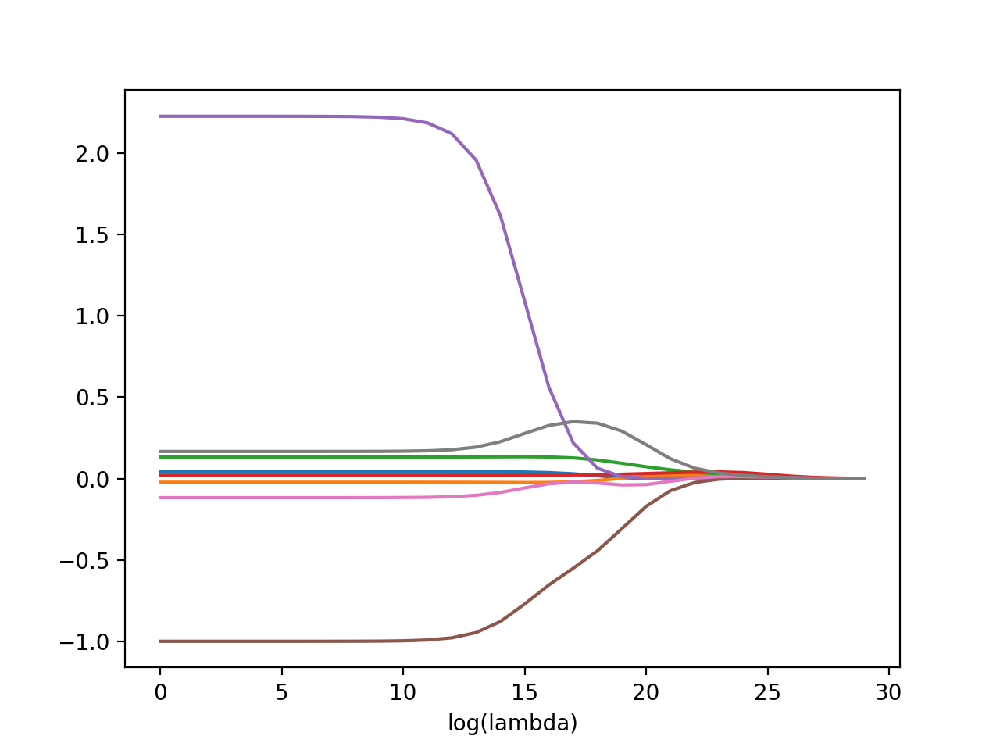
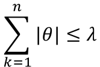
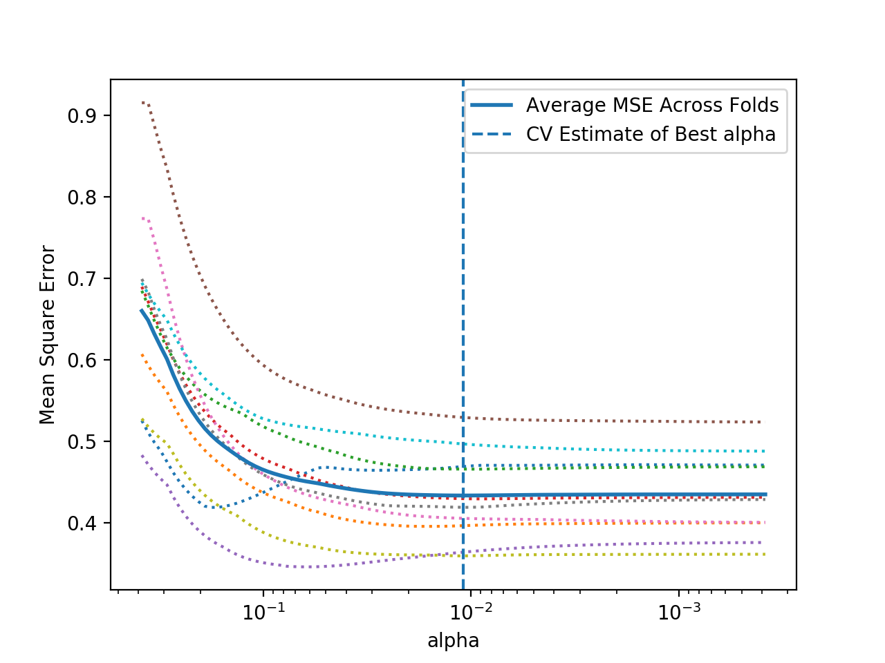

-   [预测回归二：局部加权回归和惩罚线性回归](#预测回归二局部加权回归和惩罚线性回归)
    -   [一、局部加权回归](#一局部加权回归)
        -   [原理](#原理)
        -   [python 代码实现](#python-代码实现)
    -   [二、惩罚线性回归](#二惩罚线性回归)
        -   [2.1 岭回归](#岭回归)
        -   [2.2 lasso 缩减法](#lasso-缩减法)
        -   [2.3 ElasticNet 形式化](#elasticnet-形式化)
        -   [2.4 求解惩罚线性回归问题](#求解惩罚线性回归问题)

预测回归二：局部加权回归和惩罚线性回归
======================================

一般的线性回归（关于线性回归的详细内容，参见另一篇文章：预测回归一：简单线性回归）过于简单，容易出现欠拟合与过拟合的问题。为了改进模型使其具有更好的预测效果，可以引入局部加权回归和惩罚线性回归的方法。本文介绍这两种方法的原理以及
Python 代码实现。

一、局部加权回归
----------------

### 原理

线性回归容易出现欠拟合的问题，引入局部加权线性回归可以降低预测的均方误差。

给待预测点附近的每个点赋予一定的权重，然后在这个子集上进行普通的回归。这种算法每次预测均需事先先选取出对应的数据子集。

回归系数的形式变为：



权重 W 是一个矩阵，常用的计算是使用高斯核：



超参数k的大小影响了模型的效果，选择合适的k是调参的过程。

### python 代码实现

导入数据的函数：

``` {.python}
def loadDataSet(filename, separator='\t'):
    dataSet = []
    labels = []
    with open(filename, 'r') as fr:
        for line in fr.readlines():
            lineArr = line.strip().split(separator)
            feat = []
            for i in range(len(lineArr) - 1):
                feat.append(float(lineArr[i]))
            dataSet.append(feat)
            labels.append(float(lineArr[-1]))
    return dataSet, labels
```

局部加权线性回归函数：

``` {.python}
from numpy import matrix, linalg
from numpy import eye
import numpy as np
def lwlr(tesPoint, xArr, yArr, k=1.0):
    xMat = matrix(xArr)
    yMat = matrix(yArr).T
    m = np.shape(xMat)[0]
    weight = matrix(np.eye((m)))
    for j in range(m):
        diffMat = tesPoint - xMat[j, :]
        weight[j, j] = np.exp(diffMat*diffMat.T/(-2.0*k**2))
    xTx = xMat.T * (weight * xMat)
    if linalg.det(xTx) == 0.0:
        print('矩阵无法求逆！')
        return
    theta = xTx.I * (xMat.T * (weight * yMat))
    return tesPoint * theta

def lwlrTest(testArr, xArr, yArr, k=1.0):
    m = np.shape(testArr)[0]
    yHat = np.zeros(m)
    for i in range(m):
        yHat[i] = lwlr(testArr[i], xArr, yArr, k)
    return yHat
```

使用 [ex0.txt](../resources/regression/ex0.txt)
数据集测试局部加权线性回归的拟合效果。

``` {.python}
yHat = lwlrTest(x, x, y, 0.003)
xMat = matrix(x)
y = matrix(y)
srtInd = xMat[:, 1].argsort(0)
xSort = xMat[srtInd][:, 0, :]
fig = plt.figure()
ax = fig.add_subplot(111)
ax.scatter(xMat[:, 1].flatten().A[0], y.T[:, 0].flatten().A[0], s=2)
ax.plot(xSort[:, 1], yHat[srtInd], C='black')
plt.show()
```

从图中可以看出拟合曲线很好得拟合了数据。


接下来使用真实数据—— UCI 的鲍鱼数据
[abalone.txt](../resources/regression/abalone.txt) ——应用局部加权回归。
计算平方误差作为评价指标：

``` {.python}
def rssError(yArr, yHarArr):
    return ((yArr - yHarArr) ** 2).sum()
```

``` {.python}
abX, abY = loadDataSet('abalone.txt')
yHat01 = lwlrTest(abX[0:99], abX[0:99], abY[0:99], 0.1)
yHat1 = lwlrTest(abX[0:99], abX[0:99], abY[0:99], 1)
yHat10 = lwlrTest(abX[0:99], abX[0:99], abY[0:99], 10)
resE01 = rssError(abY[0:99], yHat01.T)
resE1 = rssError(abY[0:99], yHat1.T)
resE10 = rssError(abY[0:99], yHat10.T)
print('k=0.1 ressError:', resE01)
print('k=1 ressError:', resE1)
print('k=10 ressError:', resE10)
```

输出结果为：

    k=0.1 ressError: 56.7842091184
    k=1 ressError: 429.89056187
    k=10 ressError: 549.118170883

应用到新数据

``` {.python}
yHat01 = lwlrTest(abX[100:199], abX[0:99], abY[0:99], 0.1)
yHat1 = lwlrTest(abX[100:199], abX[0:99], abY[0:99], 1)
yHat10 = lwlrTest(abX[100:199], abX[0:99], abY[0:99], 10)
resE01 = rssError(abY[100:199], yHat01.T)
resE1 = rssError(abY[100:199], yHat1.T)
resE10 = rssError(abY[100:199], yHat10.T)
print('k=0.1 ressError:', resE01)
print('k=1 ressError:', resE1)
print('k=10 ressError:', resE10)
```

    k=0.1 ressError: 25119.4175118
    k=1 ressError: 573.52614419
    k=10 ressError: 517.571190538

以上结果显示了调参的必要性，在未知数据中才能选取到最佳模型。

二、惩罚线性回归
----------------

惩罚线性回归就是在回归系数的计算公式中加入惩罚项（也称为正则化），以解决线性回归过拟合的问题。

### 2.1 岭回归

如果特征比样本点还多(n&gt;m)，也就是说输入矩阵 X
不是满秩矩阵，求逆会出现问题。为了解决这个问题，引入了岭回归(ridge
regression)的概念。

具体做法就是在矩阵上加入一项，使得矩阵非奇异，可以求逆。通过惩罚项，能够减少不重要的参数，也叫做缩减(shrinkage)。随着lambda的增大，所有系数会逐渐缩减到
0。



该正规方程等价于在代价函数中加入一项系数L2惩罚项：



梯度下降算法变形为： 

岭回归实现代码：

``` {.python}
from numpy import linalg
from numpy import eye, shape, mat, mean, var, zeros, exp, inf
import matplotlib.pyplot as plt


def ridgeRegres(xMat, yMat, lam=0.2):
    xTx = xMat.T * xMat
    denom = xTx + eye(shape(xMat)[1]) * lam
    if linalg.det(denom) == 0.0:
        print("This matrix is singular, cannot do inverse")
        return
    ws = denom.I * (xMat.T * yMat)
    return ws


def ridgeTest(xArr, yArr):
    xMat = mat(xArr)
    yMat = mat(yArr).T
    # 数据标准化
    yMean = mean(yMat, 0)
    yMat = yMat - yMean
    xMeans = mean(xMat, 0)
    xVar = var(xMat, 0)
    xMat = (xMat - xMeans) / xVar
    numTestPts = 30
    wMat = zeros((numTestPts, shape(xMat)[1]))
    for i in range(numTestPts):
        # 测试 30 个不同的 lambda
        ws = ridgeRegres(xMat, yMat, exp(i - 10))
        wMat[i, :] = ws.T
    return wMat
```

应用鲍鱼数据集

``` {.python}
abX, abY = loadDataSet('abalone.txt')
ridgeWeights = ridgeTest(abX, abY)
fig = plt.figure()
ax = fig.add_subplot(111)
ax.plot(ridgeWeights)
plt.xlabel('log(lambda)')
plt.show()
```

得到类似下面的结果图，该图给出回归系数与 log(lambda)
的关系。在最左边，即lambda最小时，可以得到所有系数的原始值（与线性回归一致）；而在右边，系数全部缩减成0；在中间的部分的某值将可以得到最好的预测结果。为了定量寻找最佳参数值，还需要进行交叉验证。


scikit-learn
框架提供了岭回归模块：[Ridge](https://scikit-learn.org/stable/modules/generated/sklearn.linear_model.Ridge.html#sklearn.linear_model.Ridge)，以及通过内置的
Alpha 参数的交叉验证来实现岭回归：
[RidgeCV](https://scikit-learn.org/stable/modules/generated/sklearn.linear_model.RidgeCV.html#sklearn.linear_model.RidgeCV)

### 2.2 lasso 缩减法

惩罚回归另一个有用的算法称作套索 (Lasso) 回归，该回归源于曼哈顿距离或者
L1 正则化。

lasso是对系数的约束条件改为使用绝对值，对应的约束条件为：



lasso需要二次规划算法进行计算，一种更为简单的方法是**前向逐步回归**。

逐步线性回归算法的主要优点在于它可以帮助人们理解现有模型并作出改进。当构建了一个模型后，可以运行该算法找出重要的特征，这样就有可能及时停止对那些不重要特征的收集。

lasso 的系数是稀疏的，意味着许多系数等于0，相当于可以忽略一些变量。

python 代码实现：

``` {.python}
from numpy import shape, mat, mean, var, zeros, inf


def rssError(yArr, yHarArr):
    return ((yArr - yHarArr) ** 2).sum()

def regularize(xMat):
    # 数据标准化
    inMat = xMat.copy()
    inMeans = mean(inMat,0)
    inVar = var(inMat,0)
    inMat = (inMat - inMeans)/inVar
    return inMat


def stageWise(xArr, yArr, eps=0.01, numIt=100):
    """lasso 前向逐步线性回归"""
    xMat = mat(xArr)
    yMat = mat(yArr).T
    yMean = mean(yMat, 0)
    yMat = yMat - yMean
    xMat = regularize(xMat)
    m, n = shape(xMat)
    returnMat = zeros((numIt, n))
    ws = zeros((n, 1))
    wsTest = ws.copy()
    wsMax = ws.copy()
    for i in range(numIt):
        lowestError = inf
        for j in range(n):
            for sign in [-1, 1]:
                wsTest = ws.copy()
                wsTest[j] += eps * sign
                yTest = xMat * wsTest
                rssE = rssError(yMat.A, yTest.A)
                if rssE < lowestError:
                    lowestError = rssE
                    wsMax = wsTest
        ws = wsMax.copy()
        returnMat[i, :] = ws.T
    return returnMat

abX, abY = loadDataSet('abalone.txt')
stageWise(abX, abY, 0.01, 200)
```

在 scikit-learn
框架中，[sklearn.linear\_model.LassoCV](https://scikit-learn.org/stable/modules/generated/sklearn.linear_model.LassoCV.html#sklearn.linear_model.LassoCV)
通过交叉验证生成对 Lasso 模型性能的样本外估计。CV
包中使用均方差（MSE）评估模型。

在红酒口感数据集(https://archive.ics.uci.edu/ml/machine-learning-databases/wine-quality/winequality-red.csv)上使用交叉验证来估计Lasso模型的样本外错误：

``` {.python}
import pandas as pd
from sklearn.linear_model import LassoCV
from sklearn import preprocessing
import matplotlib.pyplot as plt


datadf = pd.read_csv('../MLTools/dataSet/winequality-red.csv', header=0, sep=';')

X, y = datadf.iloc[:, 0:-1].values, datadf.iloc[:, -1].values
X_norm = preprocessing.scale(X)
y_norm = preprocessing.scale(y)

wineModel = LassoCV(cv=10).fit(X_norm, y)

plt.figure()
plt.plot(wineModel.alphas_, wineModel.mse_path_, ':')
plt.plot(wineModel.alphas_, wineModel.mse_path_.mean(axis=-1),
         label='Average MSE Across Folds', linewidth=2)
plt.axvline(wineModel.alpha_, linestyle='--',
            label='CV Estimate of Best alpha')
plt.semilogx()
plt.legend()
ax = plt.gca()
ax.invert_xaxis()
plt.xlabel('alpha')
plt.ylabel('Mean Square Error')
plt.axis('tight')
plt.show()
```

得到如下图所示结果：



### 2.3 ElasticNet 形式化

惩罚回归问题的 ElasticNet 形式是使用一个可调节的岭回归以及 Lasso
回归的混合。引入一个额外的参数 alpha 用于控制岭回归和 Lasso
的比例。alpha = 1 表示只使用 Lasso，不实用岭回归。

### 2.4 求解惩罚线性回归问题

两种用于解决惩罚线性回归的算法：最小角度回归 LARS 以及 Clmnet。

(1) 最小角度回归 LARS 算法

LARS 可以理解为一种改进的前向逐步回归算法。 <br>前向逐步回归算法：
<br> 将系数 beta 初始化为 0 <br> 在每一步中
<br> 使用已经选择的变量找到残差值
<br> 确定哪个未使用的变量能够最佳的解释残差，将该变量加入选择变量中。
<br>最小角度回归算法 LARS： <br> 将系数 beta 初始化为 0 <br> 在每一步中
<br> 决定哪个属性与残差有最大的关联
<br> 如果关联为正，小幅度增加关联系数；关联为负，小幅度减小关联系数。
