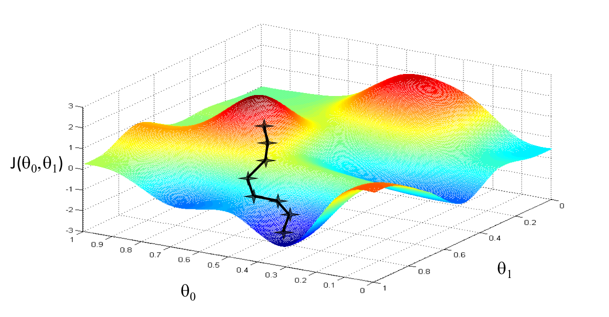
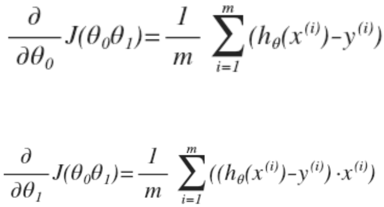
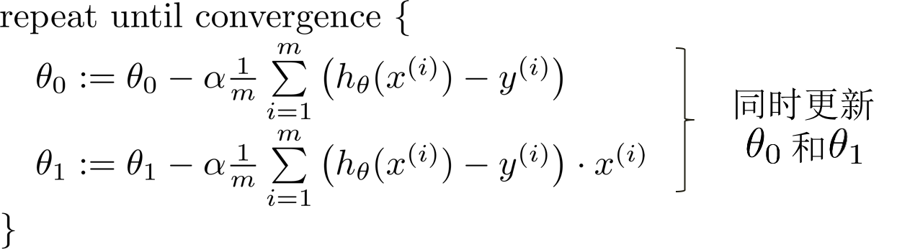
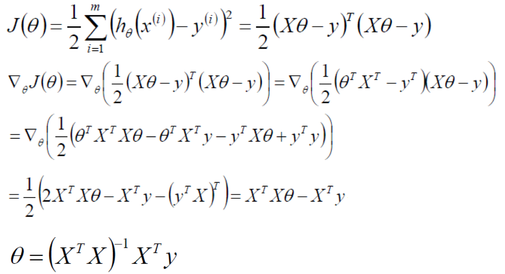
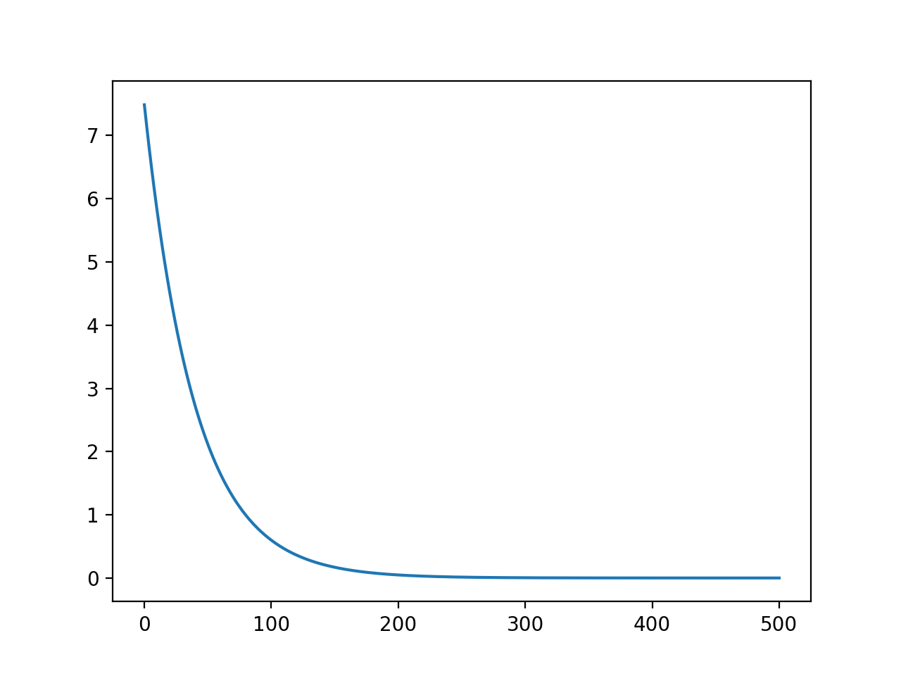
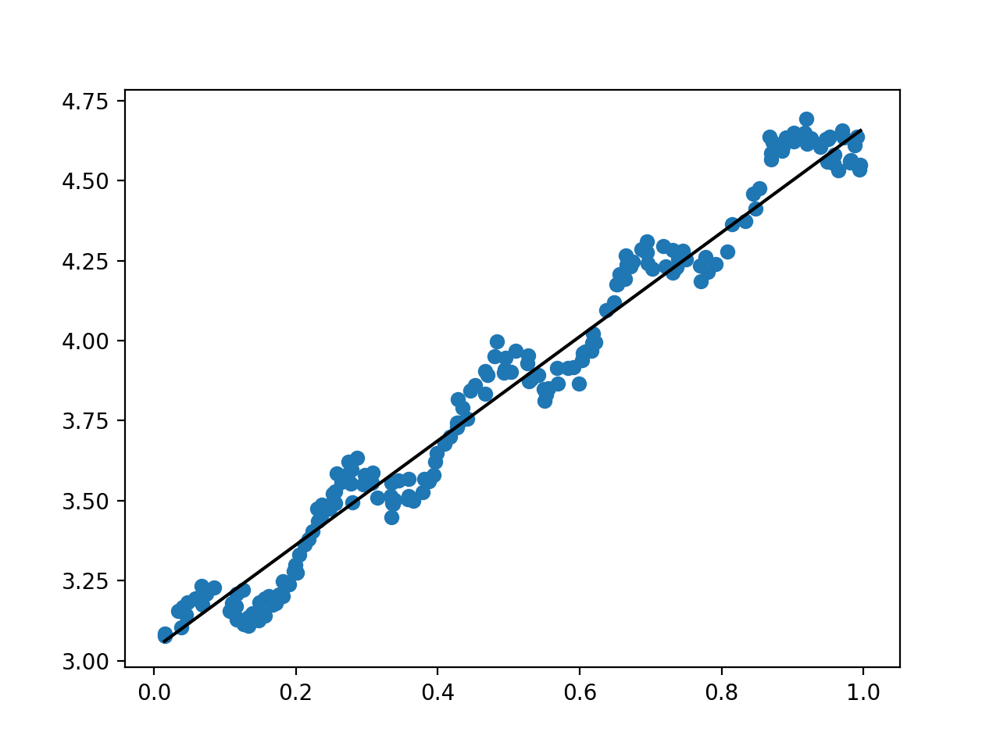

# 预测回归一：简单线性回归

-   [1、单变量线性回归](#单变量线性回归)
-   [2、多变量线性回归](#多变量线性回归)
-   [3、多项式回归](#多项式回归)
-   [4、正规方程](#正规方程)
-   [5、Python 代码实现](#python-代码实现)
    -   [梯度下降算法](#梯度下降算法)
    -   [正规方程](#正规方程-1)

>回归的目的是预测数值型的目标值。

本章介绍单变量线性回归和多变量线性回归，然后给出 Python 实战案例。

## 1、单变量线性回归

假设自变量 x 与因变量 y 之间是线性函数的关系，可以假设线性函数为：


回归系数为：


以平方误差计算代价函数：


其中，x，y 是输入数据（训练集），h 是y的预测值。此代价函数也被称为平方误差函数 ( square error function )，或平方误差代价函数 ( square error cost function )。误差平方对于大多数问题，尤其是回归问题都是合理的选择。平方误差函数是解决回归问题最常用的方式。

求解回问题转化为优化问题，优化目标是使代价函数（或称为损失函数）最小：


采用**梯度下降算法**求解优化问题。梯度下降背后的思想是：开始时我们随机选择一个参数的组合，计算代价
函数，然后我们寻找下一个能让代价函数值下降最多的参数组合。我们持续这么做直到到到
一个局部最小值（ local minimum） ， 因为我们并没有尝试完所有的参数组合，所以不能确定
我们得到的局部最小值是否便是全局最小值（ global minimum），选择不同的初始参数组合，
可能会找到不同的局部最小值。下图是梯度下降的直观示意图：



参数的计算公式可以写为：


其中 α 是学习率（ learning rate），是决定收敛速度的超参数。

求解上面的方程关键在于求偏导：



求导后得到；



以上公式就是梯度下降算法求单变量解线性回归的递归公式。


## 2、多变量线性回归
多变量线性回归的推导过程同单变量线性回归一样，最后得到梯度下降的递归公式：


## 3、多项式回归

可以通过变量变换转化为多变量线性回归。如：


## 4、正规方程
求解线性回归还有另一种方法，它可以在不需要多步梯度下降的情况下，也能解出代价函数 J 的最小值，这是另一种称为正规方程(normal equations)的方法。

设有 n 个特征，有 m 个样本。


则可以直接通过正规方程计算参数：


推导过程：




## 5、Python 代码实现

测试数据集使用 [ex0.txt](../resources/regression/ex0.txt)，数据文件中第二列是自变量 x，第三列是因变量 y，而第一列全为1，故而前两列可以作为矩阵 X。 

### 梯度下降算法
首先是导入所需的包：
```python
from numpy import matrix, linalg
import numpy as np
import matplotlib.pyplot as plt
```
加载样例数据
```python
def loadDataSet(filename, separator='\t'):
    dataSet = []
    labels = []
    with open(filename, 'r') as fr:
        for line in fr.readlines():
            lineArr = line.strip().split(separator)
            feat = []
            for i in range(len(lineArr) - 1):
                feat.append(float(lineArr[i]))
            dataSet.append(feat)
            labels.append(float(lineArr[-1]))
    return dataSet, labels
```

根据代价函数的计算公式，得到代价函数的计算函数：
```python
def costJ(X, y, theta):
    """
    计算代价函数,(注意这里的X，和 y 都是 numpy 的 matrix 对象)
    :param X: matrix, [X0, X1, X2, ..., Xn]^T, X0 = 1, m * (n+1) 矩阵, m 个样本，n个特征
    :param y: matrix, [y1, y2, ..., ym], 1 * m  向量
    :param theta: 1 * m 向量, 权重
    """
    m = float(len(y))
    j = (X * theta - y)
    J = sum(j.transpose() * j) / (2*m)
    return float(J)
```

根据梯度下降的迭代公式，计算回归系数：
```python
def linear_regres(X, y, alpha, num_iters):
    """
    梯度下降算法求解线性规划
    :param X: list, [X0, X1, X2, ..., Xn]^T, X0 = 1, m * (n+1) 矩阵, m 个样本，n个特征
    :param y: list, [y1, y2, ..., ym], m * 1 向量
    :param alpha: 学习率
    :param num_iters: 最大迭代次数
    :return:
    """
    m = float(len(y))
    X = matrix(X)
    y = matrix(y).transpose()
    theta = matrix([[0.], [0.]])
    J = []
    J.append(costJ(X, y, theta))
    theta_s = theta.copy()
    for i in range(num_iters):
        theta[0] -= alpha / m * sum(X * theta_s - y)
        theta[1] -= alpha / m * sum((X * theta_s - y).transpose() * X[:, 1])
        J.append(costJ(X, y, theta))
        theta_s = theta.copy()
    return theta, J
```
导入数据求解线性回归：
```python
x, y = loadDataSet('ex0.txt')
theta, J = linear_regres(x, y, 0.01, 500)
plt.plot(range(len(J)), J)
plt.show()
```
绘制代价函数随迭代次数的变化：


绘制样例数据与拟合曲线：
```python
def plot_reg_line(X, y, theta):
    X = matrix(X)
    y = matrix(y)
    fig = plt.figure()
    aX = fig.add_subplot(111)
    aX.scatter(X[:, 1].flatten().A[0], y.T[:, 0].flatten().A[0])
    XCopy = X.copy()
    XCopy.sort(0)
    yH = XCopy*theta
    aX.plot(XCopy[:, 1], yH, C='black')
    plt.show()
```
```python
plot_reg_line(x, y, theta)
```


### 正规方程

根据正规方程求解线性回归：
```python
def normal_equ(X, y):
    """
    正规方程计算线性回归,theta = (X^T*X)^-1*X^T*y
    :param X: list, [X0, X1, X2, ..., Xn]^T, X0 = 1, m * (n+1) 矩阵, m 个样本，n个特征
    :param y: list, [y1, y2, ..., ym], m * 1 向量
    :return: theta, 1 * m 向量, 权重
    """
    X = matrix(X)
    y = matrix(y).transpose()
    XTX = (X.transpose() * X)
    if linalg.det(XTX) == 0.0:
        print('矩阵无法求逆！')
        return
    theta = XTX.I * X.transpose() * y
    return theta
```
由正规方程求解的就是最佳拟合曲线：
```python
x, y = datasets.loadDataSet('ex0.txt')
theta = normal_equ(x, y)
print(theta)
plot_reg_line(x, y, theta)
```