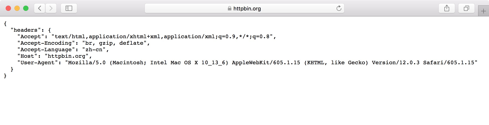

Python 爬虫：requests 和 selenium 伪装 headers 和代理应对反爬机制
=================================================================

-   [目录](#python-爬虫requests-和-selenium-伪装-headers-和代理应对反爬机制)
    -   [1、requests 伪装 headers
        发送请求](#requests-伪装-headers-发送请求)
    -   [2、selenium 模拟使用浏览器伪装
        headers](#selenium-模拟使用浏览器伪装-headers)
    -   [3、requests 使用 ip
        代理发送请求](#requests-使用-ip-代理发送请求)
    -   [4、selenium webdriver 使用代理
        ip](#selenium-webdriver-使用代理-ip)

在编写爬虫的过程中，有些网站会设置反爬机制，对于非浏览器的访问拒绝响应；或短时间频繁爬取会触发网站的反爬机制，导致
ip 被封无法爬取网页。这就需要在爬虫程序中修改请求的 headers
伪装浏览器访问，或者使用代理发起请求。从而绕开网站的反爬机制获取正确的页面。

本文使用 python3.6，常用的请求库 requests 以及自动化测试库 selenium
使用浏览器。 关于这两个库的使用请参考官方文档或本人另一篇博客: [python
爬虫获取网页 html 内容以及下载附件的方法](gethtmlcontent.md)。

1、requests 伪装 headers 发送请求
---------------------------------

requests 发送的请求所带的请求头中 User-Agent 会标识为 python
程序发送的请求，如下所示：

``` {.python}
import requests

url = 'https://httpbin.org/headers'

response = requests.get(url)

if response.status_code == 200:
    print(response.text)
```

返回结果：

``` {.text}
{
  "headers": {
    "Accept": "*/*", 
    "Accept-Encoding": "gzip, deflate", 
    "Host": "httpbin.org", 
    "User-Agent": "python-requests/2.20.1"
  }
}
```

> 注：<https://httpbin.org>
> 是一个开源的，用于测试网页请求的网站，比如上面的/headers的链接，将会返回所发送请求的请求头。详情请参考其官网。

> User-Agent: 用户代理（英语：User
> Agent）指的是代表用户行为的软件代理程序所提供的对自己的一个标识符。用于标识浏览器类型及版本、操作系统及版本、浏览器内核、等信息的标识。详情见维基百科词条：[User
> agent](https://en.wikipedia.org/wiki/User_agent)

对于有反爬的网站会识别其 headers
从而拒绝返回正确的网页。此时需要对发送的请求伪装成浏览器的 headers。

用浏览器打开 https://httpbin.org/headers
网站，将会看的下面的页面，这就是该浏览器的 headers。



将上面的请求头复制下来，传给 `requests.get()`
函数，即可将请求伪装成浏览器。

``` {.python}
import requests

url = 'https://httpbin.org/headers'

myheaders = {
    "Accept": "text/html,application/xhtml+xml,application/xml;q=0.9,*/*;q=0.8",
    "Accept-Encoding": "br, gzip, deflate",
    "Accept-Language": "zh-cn",
    "Host": "httpbin.org",
    "User-Agent": "Mozilla/5.0 (Macintosh; Intel Mac OS X 10_13_6) AppleWebKit/605.1.15 (KHTML, like Gecko) Version/12.0.3 Safari/605.1.15"
  }

response = requests.get(url, headers=myheaders)

if response.status_code == 200:
    print(response.text)
```

返回的结果变成：

``` {.text}
{
  "headers": {
    "Accept": "text/html,application/xhtml+xml,application/xml;q=0.9,*/*;q=0.8", 
    "Accept-Encoding": "br, gzip, deflate", 
    "Accept-Language": "zh-cn", 
    "Host": "httpbin.org", 
    "User-Agent": "Mozilla/5.0 (Macintosh; Intel Mac OS X 10_13_6) AppleWebKit/605.1.15 (KHTML, like Gecko) Version/12.0.3 Safari/605.1.15"
  }
}
```

在应用爬虫的时候，可以随机跟换其他 User-Agent 避免触发反爬。

2、selenium 模拟使用浏览器伪装 headers
--------------------------------------

使用自动化测试工具 selenium 可以模拟使用浏览器访问网站。本文使用
selenium 3.14.0 版本，该版本支持 Chrome 和 Firefox
浏览器。要使用浏览器需下载对应版本的 driver。

Driver 下载地址：

  Browser   Links
  --------- ----------------------------------------------------------------
  Chrome    https://sites.google.com/a/chromium.org/chromedriver/downloads
  Firefox   https://github.com/mozilla/geckodriver/releases

使用 webdriver 访问本身自带浏览器的 headers。

``` {.python}
from selenium import webdriver

url = 'https://httpbin.org/headers'

driver_path = '/path/to/chromedriver'
browser = webdriver.Chrome(executable_path=driver_path)
browser.get(url)

print(browser.page_source)
browser.close()
```

打印出返回的网页代码：

``` {.text}
<html xmlns="http://www.w3.org/1999/xhtml"><head></head><body><pre style="word-wrap: break-word; white-space: pre-wrap;">{
  "headers": {
    "Accept": "text/html,application/xhtml+xml,application/xml;q=0.9,image/webp,image/apng,*/*;q=0.8", 
    "Accept-Encoding": "gzip, deflate, br", 
    "Accept-Language": "zh-CN,zh;q=0.9", 
    "Host": "httpbin.org", 
    "Upgrade-Insecure-Requests": "1", 
    "User-Agent": "Mozilla/5.0 (Macintosh; Intel Mac OS X 10_13_6) AppleWebKit/537.36 (KHTML, like Gecko) Chrome/72.0.3626.121 Safari/537.36"
  }
}
</pre></body></html>
```

浏览器 driver 也能伪装 User-Agent，只需在创建 webdriver
浏览器对象的时候传入设置即可：

``` {.python}
from selenium import webdriver

url = 'https://httpbin.org/headers'

user_agent = "Mozilla/5.0 (Macintosh; Intel Mac OS X 10_13_6) AppleWebKit/605.1.15 (KHTML, like Gecko) Version/12.0.3 Safari/605.1.15"

driver_path = '/path/to/chromedriver'

opt = webdriver.ChromeOptions()
opt.add_argument('--user-agent=%s' % user_agent)

browser = webdriver.Chrome(executable_path=driver_path, options=opt)
browser.get(url)

print(browser.page_source)
browser.close()
```

此时返回的 User-Agent 就变成传入的设置了。

``` {.text}
<html xmlns="http://www.w3.org/1999/xhtml"><head></head><body><pre style="word-wrap: break-word; white-space: pre-wrap;">{
  "headers": {
    "Accept": "text/html,application/xhtml+xml,application/xml;q=0.9,image/webp,image/apng,*/*;q=0.8", 
    "Accept-Encoding": "gzip, deflate, br", 
    "Accept-Language": "zh-CN,zh;q=0.9", 
    "Host": "httpbin.org", 
    "Upgrade-Insecure-Requests": "1", 
    "User-Agent": "Mozilla/5.0 (Macintosh; Intel Mac OS X 10_13_6) AppleWebKit/605.1.15 (KHTML, like Gecko) Version/12.0.3 Safari/605.1.15"
  }
}
</pre></body></html>
```

Firefox 浏览器 driver 的设置有所不同：

``` {.python}
from selenium import webdriver

url = 'https://httpbin.org/headers'

user_agent = "Mozilla/5.0 (Macintosh; Intel Mac OS X 10_13_6) AppleWebKit/605.1.15 (KHTML, like Gecko) Version/12.0.3 Safari/605.1.15"

driver_path = '/path/to/geckodriver'

profile = webdriver.FirefoxProfile()
profile.set_preference("general.useragent.override", user_agent)

browser = webdriver.Firefox(executable_path=driver_path, firefox_profile=profile)
browser.get(url)

print(browser.page_source)
browser.close()
```

3、requests 使用 ip 代理发送请求
--------------------------------

当一个 ip
短时间访问太过频繁时，网站的反爬机制会被触发，将会要求输入验证码甚至封锁
ip 禁止访问。此时需要使用代理 ip 发起请求才可获取正确的网页。

访问 https://httpbin.org/ip 网址可以查看自己的 ip。

``` {.python}
import requests

url = 'https://httpbin.org/ip'
response = requests.get(url)
print(response.text)
```

返回本机网络的ip：

``` {.text}
{
  "origin": "202.121.167.254, 202.121.167.254"
}
```

使用代理 IP 与1中伪装 headers
的方式相似，比如现在得到一个代理ip：58.58.213.55:8888，使用如下：

``` {.python}
import requests

proxy = {
    'http': 'http://58.58.213.55:8888',
    'https': 'http://58.58.213.55:8888'
}
response = requests.get('https://httpbin.org/ip', proxies=proxy)
print(response.text)
```

返回的就是代理 ip

``` {.text}
{
  "origin": "58.58.213.55, 58.58.213.55"
}
```

4、selenium webdriver 使用代理 ip
---------------------------------

chrome driver 使用代理 ip 的方式与伪装 user-agent 相似：

``` {.python}
from selenium import webdriver

url = 'https://httpbin.org/ip'
proxy = '58.58.213.55:8888'
driver_path = '/path/to/chromedriver'
opt = webdriver.ChromeOptions()
opt.add_argument('--proxy-server=' + proxy)

browser = webdriver.Chrome(executable_path=driver_path, options=opt)
browser.get(url)
print(browser.page_source)
browser.close()
```

打印结果：

    <html xmlns="http://www.w3.org/1999/xhtml"><head></head><body><pre style="word-wrap: break-word; white-space: pre-wrap;">{
      "origin": "58.58.213.55, 58.58.213.55"
    }
    </pre></body></html>

firefox driver 的设置略有不同，并且需要下载浏览器扩展
`close_proxy_authentication` 取消代理用户认证。可通过谷歌下载，本文使用
firefox 65.0.1 (64 位) 版本，可用的扩展文件是:
[close\_proxy\_authentication-1.1-sm+tb+fx.xpi](../resources/close_proxy_authentication-1.1-sm+tb+fx.xpi)。

代码如下：

``` {.python}
from selenium import webdriver

url = 'https://httpbin.org/ip'
proxy_ip = '58.58.213.55'
proxy_port = 8888
xpi = '/path/to/close_proxy_authentication-1.1-sm+tb+fx.xpi'
driver_path = '/path/to/geckodriver'

profile = webdriver.FirefoxProfile()
profile.set_preference('network.proxy.type', 1)
profile.set_preference('network.proxy.http', proxy_ip)  # http 代理
profile.set_preference('network.proxy.http_port', proxy_port)
profile.set_preference('network.proxy.ssl', proxy_ip)  # https 代理
profile.set_preference('network.proxy.ssl_port', proxy_port)
profile.set_preference('network.proxy.no_proxies_on', 'localhost, 127.0.0.1')
profile.add_extension(xpi)  # 添加扩展

browser = webdriver.Firefox(executable_path=driver_path, firefox_profile=profile)
browser.get(url)
print(browser.page_source)
browser.close()
```

打印的同样是代理 ip。

``` {.text}
<html platform="mac" class="theme-light" dir="ltr"><head><meta http-equiv="Content-Security-Policy" content="default-src 'none' ; script-src resource:; "><link rel="stylesheet" type="text/css" href="resource://devtools-client-jsonview/css/main.css"></head><body><div id="content"><div id="json">{
  "origin": "58.58.213.55, 58.58.213.55"
}
</div></div><script src="resource://devtools-client-jsonview/lib/require.js" data-main="resource://devtools-client-jsonview/viewer-config.js"></script></body></html>
```
