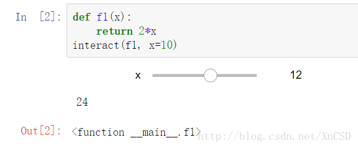
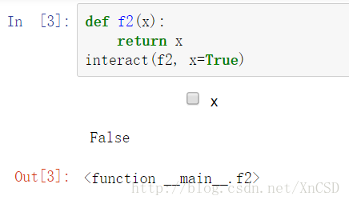
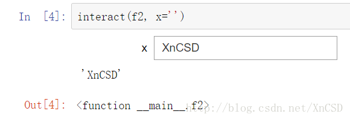
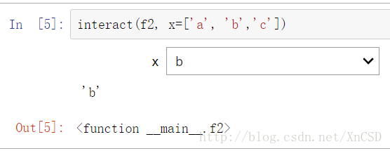
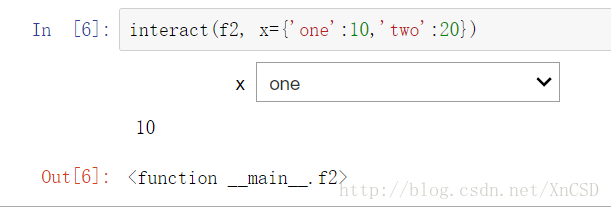
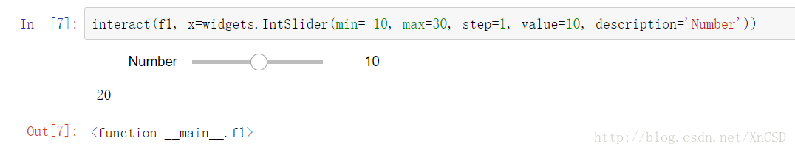

# ipywidgets 包实现 jupyter notebook 的控件交互

[ipywidgets](https://ipywidgets.readthedocs.io/en/latest/) 包可以实现 jupyter notebook 笔记本的交互式控件操作。

```python
from ipywidgets import interact
import ipywidgets as widgets
```

首先定义一个用于操作的函数：

```python
def f1(x):
	return 2*x
```

 使用 `interact()` 函数传入函数名及其参数即可实现交互式控件。
 **数值型参数：可出现一个可选滚动条，选择不同参数传入函数。**
 
 **布尔型参数：一个复选框**
 
 **文本型参数：出现文本框**
 
 **参数是列表时，出现下拉列表**
 
 **参数也可以是字典**

**对控件进行参数设置**
IntSlider(min=-10,max=30,step=1,value=10)
设置最大最小值、步长，默认值，变量描述。


更多使用方法可以参考官方文档：[https://ipywidgets.readthedocs.io/en/latest](https://ipywidgets.readthedocs.io/en/latest)。