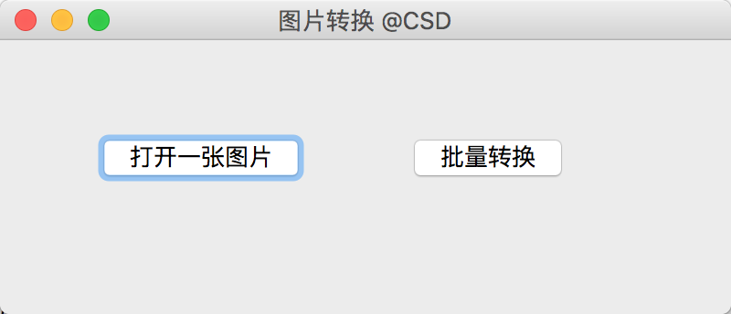
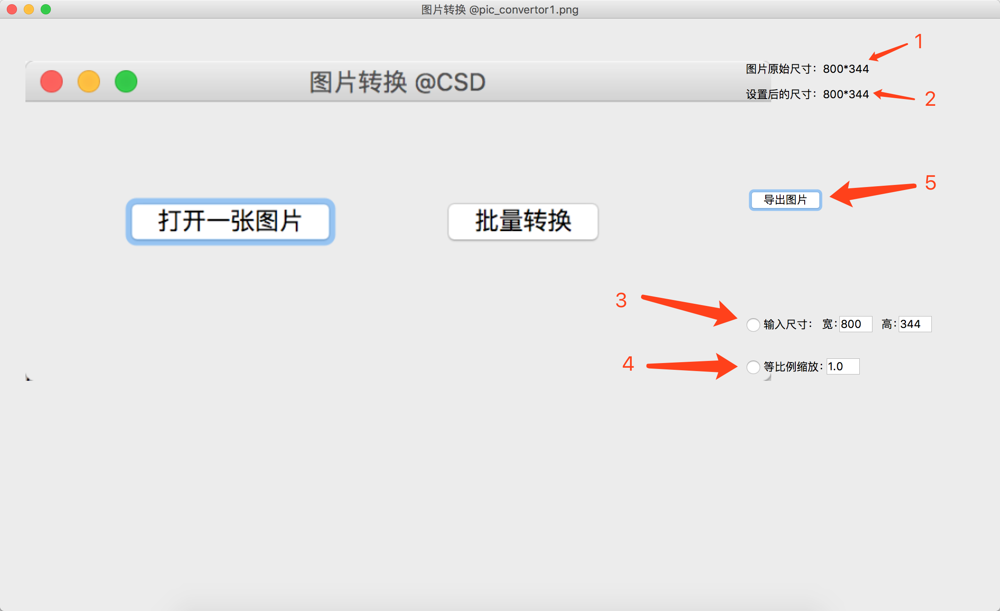
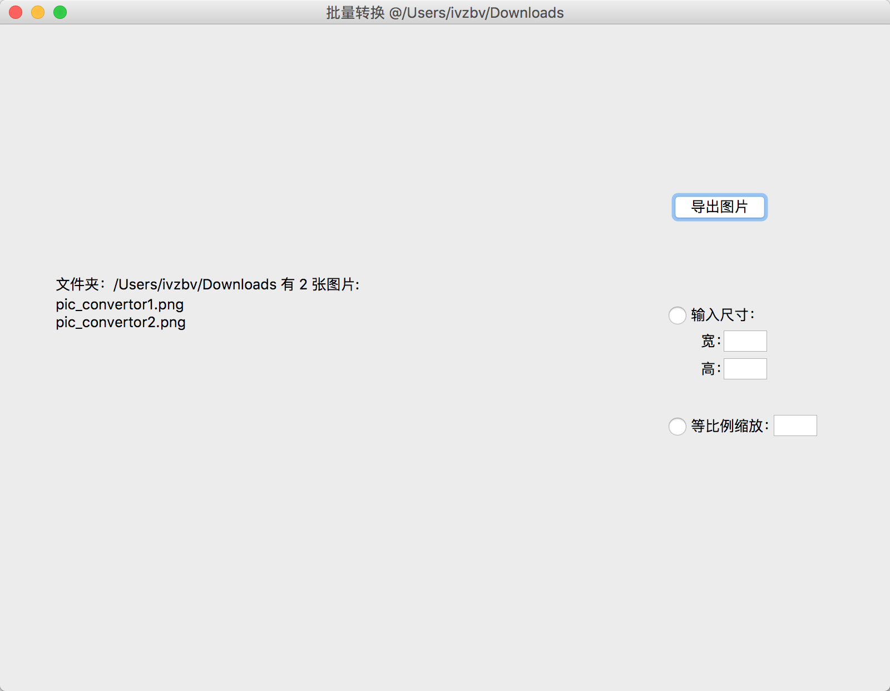

# 批量修改图片像素大小：Python GUI 交互界面实现

## 1、Python 修改图片像素大小

Python 的 PIL 包可以实现图片的读写、像素大小的设置。

安装 pillow 第三方模块：
`pip install pillow`

设置图片大小的示例代码：
```text
from PIL import Image

img = Image.open('test.jpg')
# 查看原始图片大小
width_org, hight_org = img.size
# 期望设置的大小
width = 540
hight = 640
# 或者将原始图片放大2倍
# odd = 2 # 缩放的倍数，可以小于1，相当于缩小图片尺寸
# width = int(width_org * odd)
# hight = int(hight_org * odd)

# 设置图片新的尺寸
new_img=img.resize((width,height),Image.BILINEAR)
# 保存图片
new_img.save('resize.jpg')
```

## 2、GUI 编程实现界面交互

Python 的 PyQt5 是流行的 GUI 编程模块，基于 1 中的代码，可以运用 GUI 编程的方式设计一个有窗口交互的程序。GUI 界面及基本功能如下所示：

主界面：



#### 2.1 单张图片设置

点击按钮 "打开一张图片" 打开一张图片，跳转为下面的窗口：



- 1：显示了图片原始像素大小；
- 2：显示了所要设置的像素大小；
- 3、4：选择设置的模式，可以是自定义大小，也可以选择缩放的比例，二选一；
- 5：设置完毕导出图片，将导出原图片的目录下。


#### 2.2 批量设置

主界面中选择"批量转换"，选择一个文件夹后，跳转窗口为：



同样提供了两种设置模式，操作同 2.1。


#### 2.3 完整代码

完整代码见我的 GitHub 项目 [XinanCSD/PicConvertor](https://github.com/XinanCSD/PicConvertor)。下载代码后，即可运行：

```
python pictureConvertor.py
```
