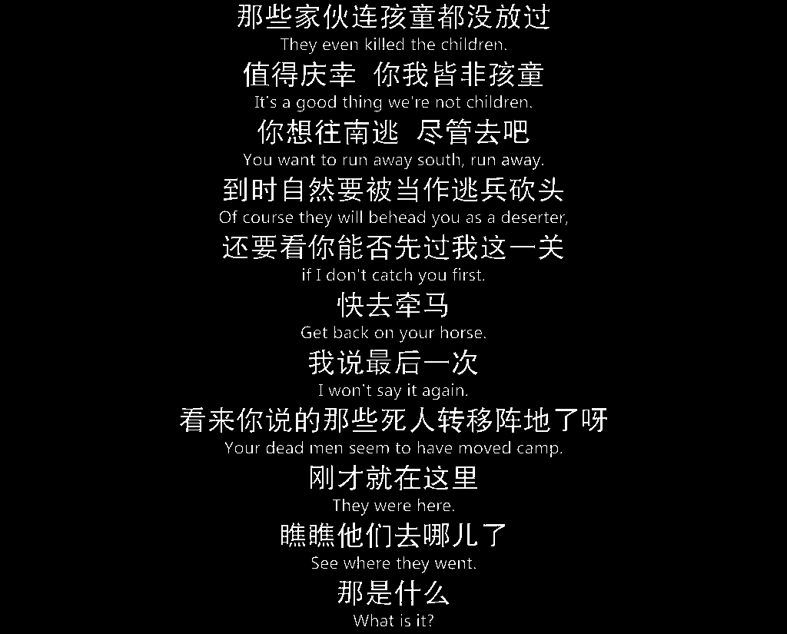

# 基于图像识别和文字识别用 Python 提取视频字幕

本文介绍使用 Python 基于图像识别提取视频中的字幕，并使用文字识别将字幕转为纯文本。本文以权力的游戏第一季第一集作为示例。

本文主要使用 OpenCV 读取视频并进行图像处理，需安装以下依赖的库：
```text
pip install opencv-python
pip install Pillow
pip install numpy
```

## 1、使用 opencv 读取视频

对于视频文件，可以使用 `cv2` 的 `VideoCapture` 类读取：
```text
import cv2

video_filename = '/Users/csd/S01E01.mkv'
videoCap = cv2.VideoCapture(video_filename)
```
调用 `get()` 方法可以得到视频文件的一些基本信息：
```text
# 帧频
fps = videoCap.get(cv2.CAP_PROP_FPS)
# 视频总帧数
total_frames = int(videoCap.get(cv2.CAP_PROP_FRAME_COUNT))
# 图像尺寸
image_size = (int(videoCap.get(cv2.CAP_PROP_FRAME_HEIGHT)), int(videoCap.get(cv2.CAP_PROP_FRAME_WIDTH)))

print(fps)
print(total_frames)
print(image_size)
```
输出：
```text
23.976023976023978
88644
(576, 1024)
```

可以看到该视频帧频为 24 fps，共 88644 帧画面，图片尺寸为 (576, 1024)。

调用 `read()` 方法可以读取一帧的图片

```text
sucess, frame = videoCap.read()
```
当 sucess 为 True 时，读取成功，此时 frame 是图像像素矩阵，三维 numpy 矩阵。

由于视频开头总会有片头，且字幕不总是在开头就出现，所以选取 1:57 位置的一帧进行演示，使用 PIL 库转为 Image 对象并显示出来，如下图所示：
```text
for i in range(2818):
    sucess, frame = videoCap.read()
    
from PIL import Image
img = Image.fromarray(frame)
img.show()
```


## 2、字幕图片提取与处理

接下来确定字幕的范围
```text
im = frame[:, :, 0]
im = im[495:570, :]     //  确定字幕的范围，注意不同的视频文件剪切的索引值不同
img = Image.fromarray(im)
img.show()
```
剪切的字幕图片如下所示：


在进行下一步分析前，需对图像做二值化处理。由于字幕的白色的，像素值为 255，将二值化阈值设为 220。
```text
thresh = 220
_, im = cv2.threshold(im, thresh, 255, cv2.THRESH_BINARY)
img = Image.fromarray(im)
img.show()
```


接下来的一个重要的问题是如何将连续的字幕提取出来，并且不重复。在此使用两张字幕计算平均平方误差的百分比，确定所需提取的字幕。选取如下4帧的字幕进行对比展示：

- `im0`: 没有字幕的一帧：

- `im1`: 上面演示的一帧；
- `im2`: `im1` 的下一帧，字幕相同；
- `im3`: 另一句字幕的一帧：


接着根据下面的公式计算两张图像间每个像素点的平方误差之和的平均值百分比：


计算每张图像与 0 值图像的误差 e（也即上述公式中b为0）：
```text
print((im0 ** 2).sum() / im0.size * 100)
print((im1 ** 2).sum() / im1.size * 100)
print((im2 ** 2).sum() / im2.size * 100)
print((im3 ** 2).sum() / im3.size * 100)
```
得到结果为：
```text
0.0
1.79817708333
1.79817708333
5.66666666667
```
可以看出，当 e > 1 时，图像才有字幕。

接着计算相同字幕和不同字幕图像直接的误差 e：
```text
print(((im2 - im1) ** 2).sum() / im1.size * 100)
print(((im3 - im1) ** 2).sum() / im1.size * 100)
```
得到
```text
0.00260416666667
6.64453125
```

可以看出误差 e > 1 时，字幕发生切换。


## 3、完整提取一个视频的字幕

为了方便文字识别，将 20 句字幕组合成一张图片。完整的提取字幕的代码如下：

```python
import cv2
from PIL import Image
import numpy as np
import os
import datetime


def format_time(second):
    hours = second // 3600
    minutes = (second - hours * 3600) // 60
    second = second - hours * 3600 - minutes * 60
    t = datetime.time(hour=hours, minute=minutes, second=second)
    return datetime.time.isoformat(t)


def cal_stderr(img, imgo=None):
    if imgo is None:
        return (img ** 2).sum() / img.size * 100
    else:
        return ((img - imgo) ** 2).sum() / img.size * 100


def save_image(ex_folder, img: Image, starts: int, ends: int):
    # 保存字幕图片到文件夹
    start_time = format_time(starts)
    end_time = format_time(ends)
    timeline = '-'.join([start_time, end_time]) + ".png"
    try:
        imgname = os.path.join(ex_folder, timeline)
        img.save(imgname)
        print('export subtitle at %s' % timeline)
    except Exception:
        print('export subtitle at %s error' % timeline)


def export_subtitle(video_filename):
    ex_folder = os.path.splitext(video_filename)[0]
    if not os.path.exists(ex_folder):
        os.mkdir(ex_folder)
    skip_frames = 2818
    videoCap = cv2.VideoCapture(video_filename)
    for i in range(skip_frames):
        videoCap.read()
    start_frame = skip_frames
    curr_frame = skip_frames
    fps = videoCap.get(cv2.CAP_PROP_FPS)
    success = True
    subtitle_img = None
    last_img = None
    img_count = 0
    while success:
        for j in range(9):
            videoCap.read()
            curr_frame += 1
        success, frame = videoCap.read()
        curr_frame += 1
        if frame is None:
            print('video: %s finish at %d frame.' % (video_filename, curr_frame))
            break

        img = frame[:, :, 0]
        img = img[495:570, :]
        _, img = cv2.threshold(img, 220, 255, cv2.THRESH_BINARY)

        if cal_stderr(img) < 1:
            continue

        if img_count == 0:
            subtitle_img = img
            print('video: %s add subtitle at %d frame.' % (video_filename, curr_frame))
            last_img = img
            img_count += 1
        elif img_count > 10:
            img_count = 0
            subtitle_img = Image.fromarray(subtitle_img)
            save_image(ex_folder, subtitle_img, int(start_frame/fps), int(curr_frame/fps))
            start_frame = curr_frame    # 开始时间往后移
        else:
            if cal_stderr(img, last_img) > 1:
                subtitle_img = np.vstack((subtitle_img, img))
                last_img = img
                img_count += 1
                print('video: %s add subtitle at %d frame.' % (video_filename, curr_frame))
    if img_count > 0:
        subtitle_img = Image.fromarray(subtitle_img)
        save_image(ex_folder, subtitle_img, int(start_frame / fps), int(curr_frame / fps))
    print('video: %s export subtitle finish!' % video_filename)


if __name__ == '__main__':
    video_filename = '/Users/csd/S01E01.mkv'
    export_subtitle(video_filename)
```

提取的字幕效果如下：



本文的方法对于电影的此类干扰比较大的视频提取效果达不到最佳，而对于公开课类的视频可以达到很好的效果。对不同类别的视频需要根据1、2节调整参数。

## 4、对字幕进行文字处理

对提取的字幕进行文字处理可以使用百度 AI 开发平台的 OCR 免费接口，具体可参考我的另一篇博文：[Python 利用百度文字识别 API 识别并提取图片中文字](./baiduAIocr.md)
